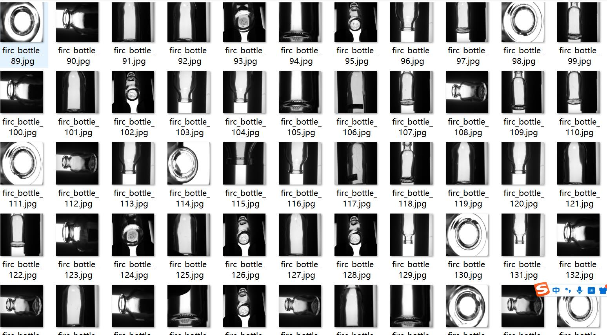
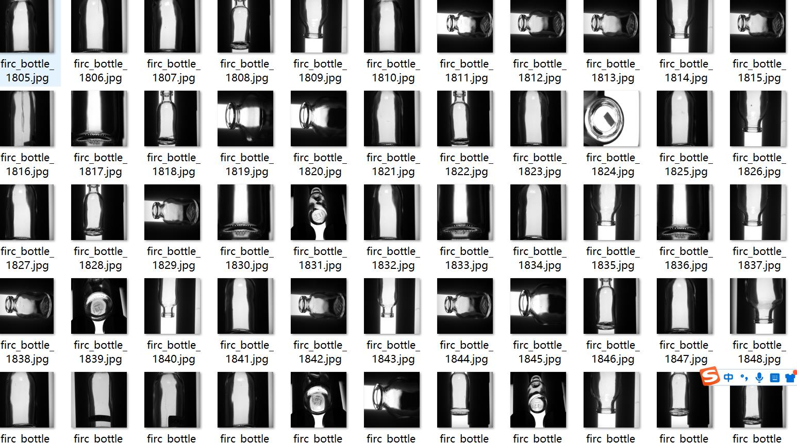
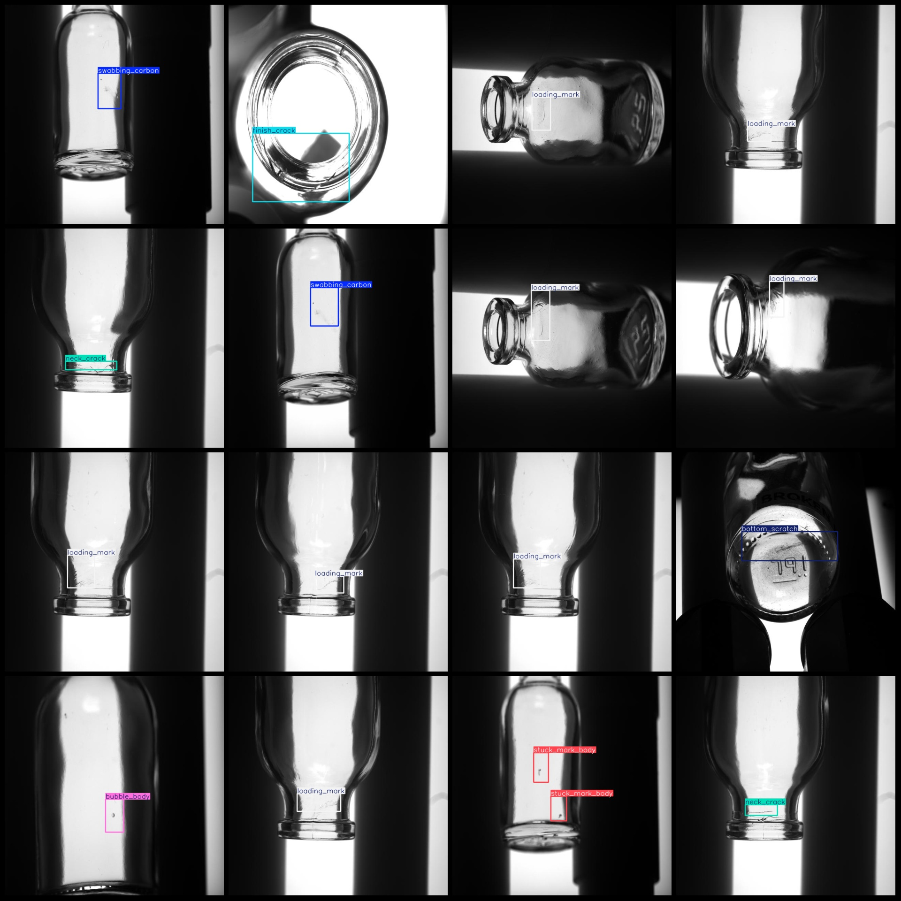
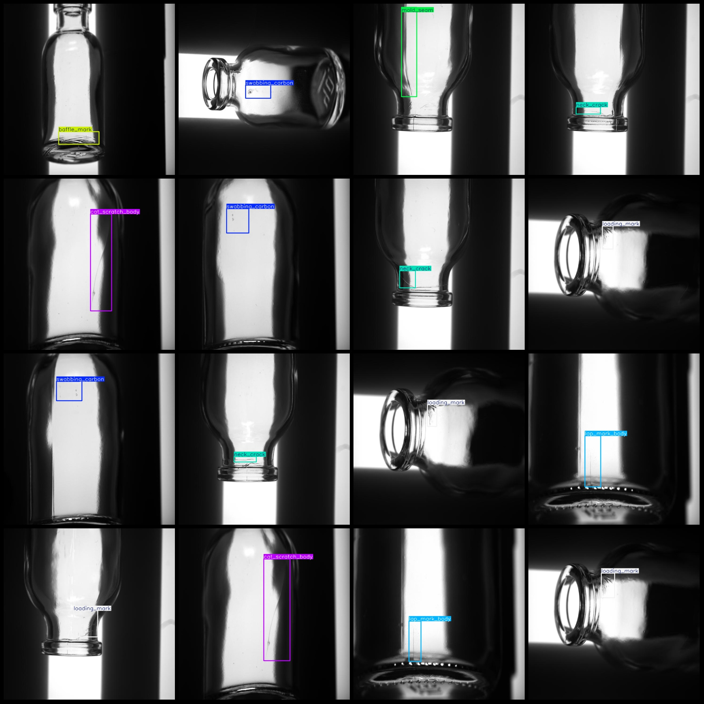

# Intelligent Industrial Glass Bottle Container Defect Detection Dataset VOC+YOLO format with 2149 images and 28 categories

Dataset format: Pascal VOC format + YOLO format (txt files without split paths, only containing jpg images and corresponding VOC format xml files and YOLO format txt files)
Number of images (jpg file count): 2149
Number of annotations (xml file count): 2149
Number of annotations (txt file count): 2149
Number of annotation categories: 28
Annotation category names (notice the order of yolo format categories does not correspond with this, but is based on classes.txt in the labels folder): ["adhered_glass_particle", "baffle_mark", "belt_mark", "black_dot", "body_scratch", "bottom_baffle_chipping", "bottom_crack", "bottom_scratch", "broken_finish", "brush_mark_neck", "brush_mark_shoulder", "bubble_body", "bubble_neck", "bubble_shoulder", "cat_scratch_body", "finish_crack", "lap_mark_body", "loading_mark", "mismatched_neck_ring_seam", "mold_seam", "neck_crack", "scratch", "shoulder_crack", "split_finish", "stuck_mark_body", "swabbing_carbon", "tear_mark", "unfilled_finish"]
Number of boxes for each category:  
adhered_glass_particle (attached glass particle) box count = 30, occupying image count = 30  
baffle_mark (baffle mark) box count = 266, occupying image count = 266  
belt_mark (belt mark) box count = 12, occupying image count = 12  
black_dot (black dot) box count = 72, occupying image count = 72  
body_scratch (bottle body scratch) box count = 5, occupying image count = 5  
bottom_baffle_chipping (bottom baffle chipping) box count = 116, occupying image count = 116  
bottom_crack (bottom crack) box count = 10, occupying image count = 10  
bottom_scratch (bottom scrape) box count = 34, occupying image count = 33
broken_finish(bottle with broken finish) box count = 61, images = 61
Brush_mark_neck box count = 41, images = 41
The given code snippet seems to be a Python function definition that takes two arguments: `box_count` and `images`. However, the actual implementation of the function is not provided in the question.

If you want to know how to implement the `brush_mark_shoulder` function with the given parameters, you can use the following example code:

```python
def brush_mark_shoulder(box_count, images):
    # Your implementation here
    pass

# Example usage
box_count = 37
images = 37
brush_mark_shoulder(box_count, images)
```

In this example, the function `brush_mark_shoulder` takes two arguments: `box_count` and `images`. You can replace the `pass` statement with your own implementation logic.

Please note that without the actual implementation details, it's difficult to provide a complete solution.
The given problem appears to be a mathematical calculation, but the description does not provide enough information for a specific mathematical operation. The "bubble_body" and "box count" variables are not defined in the context of a typical programming problem or mathematics problem.

However, if we assume that there is a mathematical operation involving these variables, the task could be interpreted as finding the product of the two numbers. In this case, the calculation would be:

`bubble_body * box_count = 190 * 133 = 24860`

So, the final answer would be `24860`.
The given problem is to create a bubble_neck function that takes two arguments: `box_count` and `images`. The `box_count` argument should be an integer, and the `images` argument should be an array of integers. The function should return an array with the same length as the `images` array.

Here's the solution in Python:

```python
def bubble_neck(box_count, images):
    return [i for i in range(1, box_count + 1)] * len(images)
```

This code defines a function called `bubble_neck` that takes two arguments: `box_count` and `images`. It uses a list comprehension to generate a new list with the same length as the `images` list, and then repeats this list `box_count` times. Finally, it returns the resulting list.
The bubble shoulder (shoulder bubble) box count is 31, and there are 31 images.
cat_scratch_bodybox count = 177，images = 164
```python
def finish_crack(box_count, images):
```python
import cv2

img_paths = ['image1.jpg', 'image2.jpg', 'image3.jpg']
num_images = len(img_paths)
print
```
    image_count = box_count * len(images)
    
    return image_count
```
Lap mark body (bottle body lapping mark) box count = 133, images = 133.
"Loading mark (loading trace) box count = 411, images = 411"
The mismatched neck ring seam (neck ring seam mismatch) box count is 9, and there are 9 images.
The mold seam (seam) box count is 50, with images numbered 50.
The neck crack (neck crack) box count is 108, with images numbered 108.
The given code is in Scratch, a visual programming language for children. The variable `boxCount` is set to 14 and `images` is set to 14.
```python
def shoulder_crack(box_count=10, images=10):
    """
    This function generates a list of 10 images with a shoulder crack.
    :param box_count: The number of images to generate. Default is 10.
    :param images: The number of images to generate. Default is 10.
    :return: A list containing 10 images with a shoulder crack.
    """
    images = [generate_image(box_count) for _ in range(images)]
    return images
```
The number of frames with the bottle mouth splitting problem is 14, and the number of pictures occupied is 14.
The number of frames for the stuck mark body (bottle body sticker) is 64, and the number of pictures it occupies is 58.
The swabbing_carbon function is used to count the number of carbon residues in an image. The box count parameter represents the total number of boxes (or areas) in the image that contain a carbon residue. The images parameter represents the list of individual images that are being counted. In this case, the box count is equal to the number of images, which is 323.
The number of tear marks (26) and the number of photos occupied by it (26) are equal.
```python
import numpy as np

def unfilled_finish(box_count, images):
    box_count = np.array(box_count)
    images = np.array(images)
    
    # Calculate the number of empty boxes
    empty_boxes = (box_count == 0).sum()
    
    # Calculate the total number of samples
    total_samples = box_count.size
    
    # Calculate the average number of empty boxes per sample
    avg_empty_boxes = empty_boxes / total_samples
    
    return avg_empty_boxes

box_count = [15]
images = [15]
print(unfilled_finish(box_count, images))
```
Total frame count: 2278
Image resolution: 640x640
Use an annotation tool: labelImg.
Annotation rule: Draw a rectangle around the class.
Important notes: The dataset does not have a separate training, validation, and test set.
Special Notice: This dataset does not guarantee the accuracy of the trained models or weight files.
Image Preview:
## Images






Here is a pay link on Stripe ( https://buy.stripe.com/3cs8yP7sY87d0vu9AB ). Please contact me lonlonago@foxmail.com after funding $89, and I will send you a complete data files , thank you!

